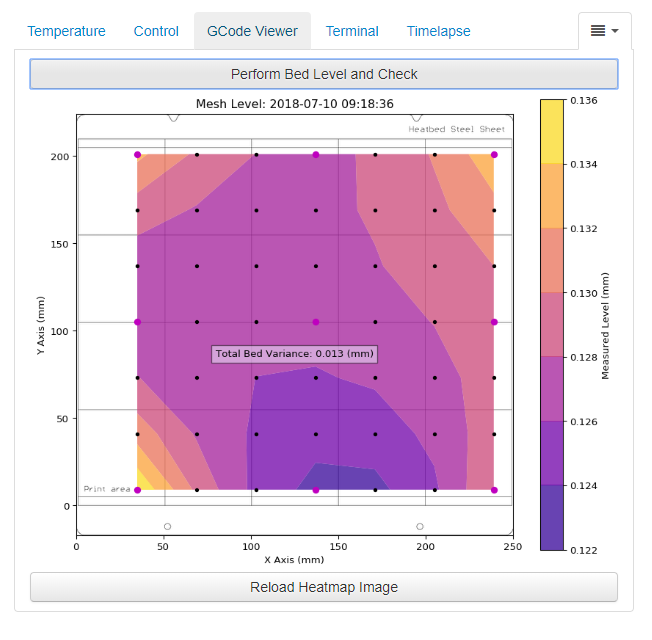
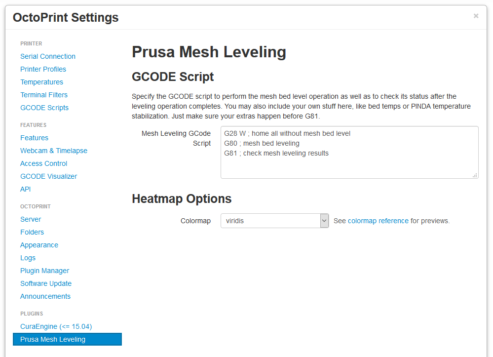

# OctoPrint-PrusaMeshMap

## This plugin is undergoing beta testing! ##

## Description

This plugin takes Prusa's G81 mesh level output and translates it into an easy to read heatmap using matplotlib.

Upon installation, you will have a "Prusa Mesh Leveling" tab:

Clicking "Perform Bed Level and Check" will execute a bed level operation and status check using a GCode script defined in the settings:

It should be noted that the heatmap image **will not** reload automatically. To reload, click "Reload Heatmap Image" below the heatmap. This is to allow you to be paying attention and see how your new bed level result changes.

## G81 Output Handler

It should be noted that this plugin has a handler that is watching output received from the printer **at all times**. This means you can place a G81 in your slicer's GCode start script and have a new heatmap generated every time you print!

## Setup

Install via the bundled [Plugin Manager](https://github.com/foosel/OctoPrint/wiki/Plugin:-Plugin-Manager)
or manually using this URL:

    https://github.com/ff8jake/OctoPrint-PrusaMeshMap/archive/v0.1.2.zip

## Troubleshooting

For many users the plugin should install without issues per the setup steps above; however, we have seen some users experience issues downloading or installing the prerequisites **matplotlib<=2.2.0** and **numpy**.

You may see the following:

* If you receive "MemoryError", this may be a limitation of Raspberry Pi Zero. We have seen some people fix a similar issue by defining ``--no-cache-dir`` in pip's options. OctoPrint's Plugin Manager > Settings > Wrench Icon > Additional Arguments field gives you a spot to add ``--no-cache-dir`` if you'd like to see if it gets you around the problem. Feedback appreciated.
* **matplotlib** stuck downloading for a long time. The user we had with this issue who was able to get into octoprint.log found a **cbook** error. This seems to be caused by the operating system not having python-backports package installed. We also had another user who just had this take a long time to install and worked fine after. Be patient if installing this on low end hardware maybe?
* If you encounter any other installation issues, please open an issue and include your hardware and operating system.
